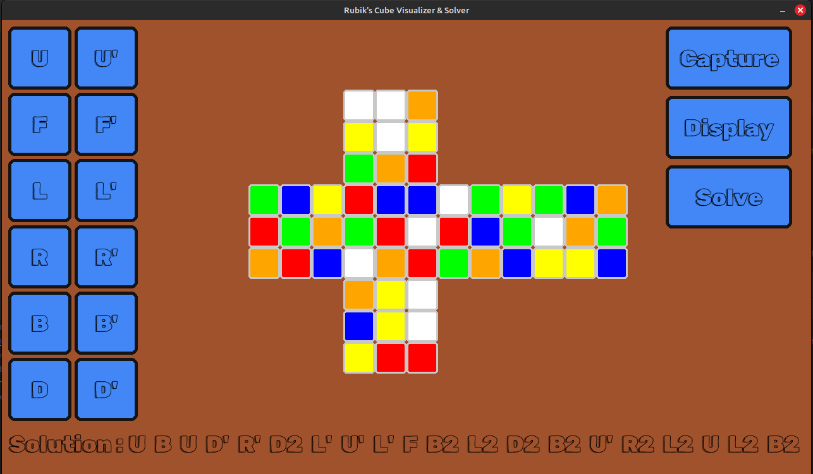

# Rubik's Cube Visualizer and Solver
________________________________

### Showcase :

> Startup Page


> Scan Window


> Solution

### Installation and Running Instructions :
- Download and Extract or Clone
- Open terminal in the folder and run:
```commandline
pip install -r requirements.txt
```
- Once all the dependencies are installed, execute the file run.py
- You can carry out movements using the buttons on left hand side
- To scan a cube use the **Capture** button
- You can scan faces in any order but the rotation orientation must be maintained.<br>
      use the following diagram as a reference

The names of the facelet positions of the cube (letters stand for Up, Left, Front, Right, Back, and Down):
```
             |************|
             |*U1**U2**U3*|
             |************|
             |*U4**U5**U6*|
             |************|
             |*U7**U8**U9*|
             |************|
 ************|************|************|************
 *L1**L2**L3*|*F1**F2**F3*|*R1**R2**R3*|*B1**B2**B3*
 ************|************|************|************
 *L4**L5**L6*|*F4**F5**F6*|*R4**R5**R6*|*B4**B5**B6*
 ************|************|************|************
 *L7**L8**L9*|*F7**F8**F9*|*R7**R8**R9*|*B7**B8**B9*
 ************|************|************|************
             |************|
             |*D1**D2**D3*|
             |************|
             |*D4**D5**D6*|
             |************|
             |*D7**D8**D9*|
             |************|
```
 - Once camera is open, press n to clear previously stored cube
 - Once all colors of a face are detected press c to capture the face
 - The program will crash if any one of the color is not detected, in that case rerun the 
program and try again, your previously scanned faces will be stored

Note : You may have to change webcam in rc_face_detector.py and recalibrate the colors for you cube.
To find new calibration value use the hsv_finder.py file and isolate each color in your lighting conditions.

- Once all six faces of the cube are scanned then press **Display** to update the onscreen cube
- Press Solve to get the solution

Note : If the solution is long, it may get clipped. You may try to adjust the font size in run.py

### Packages used :
- Numpy
- opencv
- python
- kociemba (could not install, so I downloaded the github files)<br>
Link: https://github.com/muodov/kociemba


### Font used :

Rubik Doodle Shadow : https://fonts.google.com/specimen/Rubik+Doodle+Shadow

